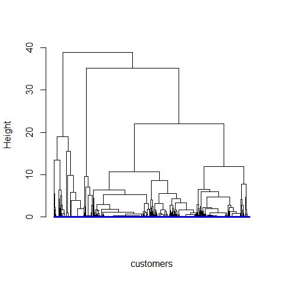
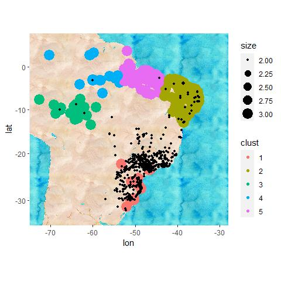

For an E-Commerce giant like Olist, Efficiency of delivering products
and conecting buyers and sellers is of the utmost importance. Any
clunkiness in the delivery pipeline is undesirable.

Our aim with this analysis is to pinpoint those issues and suggest the
solutions which will lead to an overall positive impact for the company.
This notebook contains the said analysis.

Data Loading and Pre-Processing
-------------------------------

Loading the required packages.

    library(dplyr)
    library(ggplot2)
    library(ggmap)
    library(stringr)

Loading the Joined data file called delivery\_data (Data Manipulation
and Combining Notebook contains more information) into a data frame
names delivery. This will be used to evaluate delivery network.

    delivery <- read.csv("~/R Projects/Olist-business-analysis/Joined data/delivery_data.csv", stringsAsFactors=FALSE)
    head(delivery)

    ##   order_purchase_timestamp order_delivered_customer_date
    ## 1         13-09-2017 08:59              20-09-2017 23:43
    ## 2         26-04-2017 10:53              12-05-2017 16:04
    ## 3         14-01-2018 14:33              22-01-2018 13:19
    ## 4         08-08-2018 10:00              14-08-2018 13:32
    ## 5         04-02-2017 13:57              01-03-2017 16:42
    ## 6         15-05-2017 21:42              22-05-2017 13:44
    ##   order_estimated_delivery_date                        seller_id
    ## 1              29-09-2017 00:00 48436dade18ac8b2bce089ec2a041202
    ## 2              15-05-2017 00:00 dd7ddc04e1b6c2c614352b383efe2d36
    ## 3              05-02-2018 00:00 5b51032eddd242adc84c38acab88f23d
    ## 4              20-08-2018 00:00 9d7a1d34a5052409006425275ba1c2b4
    ## 5              17-03-2017 00:00 df560393f3a51e74553ab94004ba5c87
    ## 6              06-06-2017 00:00 6426d21aca402a131fc0a5d0960a3c90
    ##                 customer_unique_id customer_lat customer_lng
    ## 1 871766c5855e863f6eccc05f988b23cb    -21.76278    -41.30963
    ## 2 eb28e67c4c0b83846050ddfb8a35d051    -20.22053    -50.90342
    ## 3 3818d81c6709e39d06b2738a8d3a2474    -19.87030    -44.59333
    ## 4 af861d436cfc08b2c2ddefd0ba074622    -23.08993    -46.61165
    ## 5 64b576fb70d441e8f1b2d7d446e483c5    -23.24340    -46.82761
    ## 6 85c835d128beae5b4ce8602c491bf385    -19.74020    -47.92479
    ##           customer_city    seller_city seller_lat seller_lng
    ## 1 campos dos goytacazes  volta redonda  -22.49695  -44.12749
    ## 2       santa fe do sul      sao paulo  -23.56510  -46.51857
    ## 3         para de minas  borda da mata  -22.26258  -46.17112
    ## 4               atibaia         franca  -20.55362  -47.38736
    ## 5       varzea paulista         loanda  -22.92938  -53.13587
    ## 6               uberaba ribeirao preto  -21.19013  -47.78790

Loading the Joined data file called transaction\_data (Data Manipulation
and Combining Notebook contains more information) into a data frame
names transaction\_data. This will be used to correlate products to
sellers and customers.

    transaction_data <- read.csv("~/R Projects/Olist-business-analysis/Joined data/transaction_data.csv", stringsAsFactors=FALSE)
    head(transaction_data)

    ##                 customer_unique_id order_purchase_timestamp
    ## 1 0000366f3b9a7992bf8c76cfdf3221e2      2018-05-10 10:56:27
    ## 2 0000b849f77a49e4a4ce2b2a4ca5be3f      2018-05-07 11:11:27
    ## 3 0000f46a3911fa3c0805444483337064      2017-03-10 21:05:03
    ## 4 0000f6ccb0745a6a4b88665a16c9f078      2017-10-12 20:29:41
    ## 5 0004aac84e0df4da2b147fca70cf8255      2017-11-14 19:45:42
    ## 6 0004bd2a26a76fe21f786e4fbd80607f      2018-04-05 19:33:16
    ##   catg_agro_industry_and_commerce catg_air_conditioning catg_art
    ## 1                               0                     0        0
    ## 2                               0                     0        0
    ## 3                               0                     0        0
    ## 4                               0                     0        0
    ## 5                               0                     0        0
    ## 6                               0                     0        0
    ##   catg_arts_and_craftmanship catg_audio catg_auto catg_baby catg_bed_bath_table
    ## 1                          0          0         0         0                   1
    ## 2                          0          0         0         0                   0
    ## 3                          0          0         0         0                   0
    ## 4                          0          0         0         0                   0
    ## 5                          0          0         0         0                   0
    ## 6                          0          0         0         0                   0
    ##   catg_books_general_interest catg_books_imported catg_books_technical
    ## 1                           0                   0                    0
    ## 2                           0                   0                    0
    ## 3                           0                   0                    0
    ## 4                           0                   0                    0
    ## 5                           0                   0                    0
    ## 6                           0                   0                    0
    ##   catg_cds_dvds_musicals catg_christmas_supplies catg_cine_photo catg_computers
    ## 1                      0                       0               0              0
    ## 2                      0                       0               0              0
    ## 3                      0                       0               0              0
    ## 4                      0                       0               0              0
    ## 5                      0                       0               0              0
    ## 6                      0                       0               0              0
    ##   catg_computers_accessories catg_consoles_games
    ## 1                          0                   0
    ## 2                          0                   0
    ## 3                          0                   0
    ## 4                          0                   0
    ## 5                          0                   0
    ## 6                          0                   0
    ##   catg_construction_tools_construction catg_construction_tools_lights
    ## 1                                    0                              0
    ## 2                                    0                              0
    ## 3                                    0                              0
    ## 4                                    0                              0
    ## 5                                    0                              0
    ## 6                                    0                              0
    ##   catg_construction_tools_safety catg_cool_stuff catg_costruction_tools_garden
    ## 1                              0               0                             0
    ## 2                              0               0                             0
    ## 3                              0               0                             0
    ## 4                              0               0                             0
    ## 5                              0               0                             0
    ## 6                              0               0                             0
    ##   catg_costruction_tools_tools catg_diapers_and_hygiene catg_drinks
    ## 1                            0                        0           0
    ## 2                            0                        0           0
    ## 3                            0                        0           0
    ## 4                            0                        0           0
    ## 5                            0                        0           0
    ## 6                            0                        0           0
    ##   catg_dvds_blu_ray catg_electronics catg_fashio_female_clothing
    ## 1                 0                0                           0
    ## 2                 0                0                           0
    ## 3                 0                0                           0
    ## 4                 0                0                           0
    ## 5                 0                0                           0
    ## 6                 0                0                           0
    ##   catg_fashion_bags_accessories catg_fashion_childrens_clothes
    ## 1                             0                              0
    ## 2                             0                              0
    ## 3                             0                              0
    ## 4                             0                              0
    ## 5                             0                              0
    ## 6                             0                              0
    ##   catg_fashion_male_clothing catg_fashion_shoes catg_fashion_sport
    ## 1                          0                  0                  0
    ## 2                          0                  0                  0
    ## 3                          0                  0                  0
    ## 4                          0                  0                  0
    ## 5                          0                  0                  0
    ## 6                          0                  0                  0
    ##   catg_fashion_underwear_beach catg_fixed_telephony catg_flowers catg_food
    ## 1                            0                    0            0         0
    ## 2                            0                    0            0         0
    ## 3                            0                    0            0         0
    ## 4                            0                    0            0         0
    ## 5                            0                    0            0         0
    ## 6                            0                    0            0         0
    ##   catg_food_drink catg_furniture_bedroom catg_furniture_decor
    ## 1               0                      0                    0
    ## 2               0                      0                    0
    ## 3               0                      0                    0
    ## 4               0                      0                    0
    ## 5               0                      0                    0
    ## 6               0                      0                    0
    ##   catg_furniture_living_room catg_furniture_mattress_and_upholstery
    ## 1                          0                                      0
    ## 2                          0                                      0
    ## 3                          0                                      0
    ## 4                          0                                      0
    ## 5                          0                                      0
    ## 6                          0                                      0
    ##   catg_garden_tools catg_health_beauty catg_home_appliances
    ## 1                 0                  0                    0
    ## 2                 0                  1                    0
    ## 3                 0                  0                    0
    ## 4                 0                  0                    0
    ## 5                 0                  0                    0
    ## 6                 1                  0                    0
    ##   catg_home_appliances_2 catg_home_comfort_2 catg_home_confort
    ## 1                      0                   0                 0
    ## 2                      0                   0                 0
    ## 3                      0                   0                 0
    ## 4                      0                   0                 0
    ## 5                      0                   0                 0
    ## 6                      0                   0                 0
    ##   catg_home_construction catg_housewares catg_industry_commerce_and_business
    ## 1                      0               0                                   0
    ## 2                      0               0                                   0
    ## 3                      0               0                                   0
    ## 4                      0               0                                   0
    ## 5                      0               0                                   0
    ## 6                      0               0                                   0
    ##   catg_kitchen_dining_laundry_garden_furniture catg_la_cuisine
    ## 1                                            0               0
    ## 2                                            0               0
    ## 3                                            0               0
    ## 4                                            0               0
    ## 5                                            0               0
    ## 6                                            0               0
    ##   catg_luggage_accessories catg_market_place catg_music
    ## 1                        0                 0          0
    ## 2                        0                 0          0
    ## 3                        0                 0          0
    ## 4                        0                 0          0
    ## 5                        0                 0          0
    ## 6                        0                 0          0
    ##   catg_musical_instruments catg_office_furniture catg_party_supplies
    ## 1                        0                     0                   0
    ## 2                        0                     0                   0
    ## 3                        0                     0                   0
    ## 4                        0                     0                   0
    ## 5                        0                     0                   0
    ## 6                        0                     0                   0
    ##   catg_perfumery catg_pet_shop catg_security_and_services
    ## 1              0             0                          0
    ## 2              0             0                          0
    ## 3              0             0                          0
    ## 4              0             0                          0
    ## 5              0             0                          0
    ## 6              0             0                          0
    ##   catg_signaling_and_security catg_small_appliances
    ## 1                           0                     0
    ## 2                           0                     0
    ## 3                           0                     0
    ## 4                           0                     0
    ## 5                           0                     0
    ## 6                           0                     0
    ##   catg_small_appliances_home_oven_and_coffee catg_sports_leisure
    ## 1                                          0                   0
    ## 2                                          0                   0
    ## 3                                          0                   0
    ## 4                                          0                   0
    ## 5                                          0                   0
    ## 6                                          0                   0
    ##   catg_stationery catg_tablets_printing_image catg_telephony catg_toys
    ## 1               0                           0              0         0
    ## 2               0                           0              0         0
    ## 3               1                           0              0         0
    ## 4               0                           0              1         0
    ## 5               0                           0              1         0
    ## 6               0                           0              0         0
    ##   catg_watches_gifts
    ## 1                  0
    ## 2                  0
    ## 3                  0
    ## 4                  0
    ## 5                  0
    ## 6                  0

By the nature of this database, everytime a new order is placed a new
customer unique id is assigned to the customer even if they are a
returning customer. Same thing happens with sellers. Hence we extract
list of unique sellers and customers from the delviery data frame.

    delivery_unique <- delivery %>% distinct(customer_lat, customer_lng, .keep_all = TRUE)
    seller_unique <- delivery %>% distinct(seller_lat, seller_lng, .keep_all = TRUE) %>% select(4,10,11)

Findind Inefficient Routes
--------------------------

We compute an additional column for our data, which will denote the
distance (Euclidean) between the customer and the seller who is
fulfilling the order. This will help us locate the cases which are very
inefficient.

    delivery_unique <- delivery_unique %>% mutate(dist= sqrt((seller_lat-customer_lat)^2 + (seller_lng - customer_lng)^2))

Now, we subset the database based on the longest 5 percentile of the
delivery routes.

    long_dist_cut <- quantile(delivery_unique$dist, 0.95, na.rm = TRUE)
    long_dist <- delivery_unique %>% filter(dist > long_dist_cut[[1]]) %>% select(4,5,6,7,10,11,12)
    head(long_dist)

    ##                          seller_id               customer_unique_id
    ## 1 e8b4225284fbb02d16f200513f1f395d f99edeaa8a00f9866fd8fce5a0b83d4f
    ## 2 955fee9216a65b617aa5c0531780ce60 fa78b26c2fa23b2ebda98c2926305c1d
    ## 3 c3cfdc648177fdbbbb35635a37472c53 77971c2442b1adbbe0448409df2ea56a
    ## 4 06a2c3af7b3aee5d69171b0e14f0ee87 f26b89209f5378f95d8e664073b76419
    ## 5 624f4ece8da4aafb77699233d480f8ef e7aa5a5869f3e9d7d04fd3aa5f90631f
    ## 6 620c87c171fb2a6dd6e8bb4dec959fc6 7af7a47d87d53e6db00e70790bba0370
    ##   customer_lat customer_lng seller_lat seller_lng     dist
    ## 1    -3.737882    -38.50270 -21.469601  -49.22222 20.72008
    ## 2    -3.504515    -39.57290 -23.691013  -46.70381 21.40898
    ## 3    -9.625897    -35.71860 -25.469955  -49.28982 20.86174
    ## 4   -23.587635    -46.74934  -2.501242  -44.24816 21.23421
    ## 5    -3.798683    -38.49321 -23.484770  -46.73414 21.34139
    ## 6    -1.438142    -48.46248 -22.540797  -43.20124 21.74863

We need to find out whether these occurances are due to seperate one off
customers or is there particular localities who are getting deliveries
from distant sellers. In the former case things should be left as is but
in case of the latter we can find sollutions.

For this goal we will be clustering customers based on their
Geo-location. First we will be using Heirarchial clustering which is an
agglomerative clustering which will tell us approximately how many
clusters of similar property (in this case geo location) are present in
our data set. We will produce a dendogram to visualise and help us with
this process.

    hc <- hclust(dist(long_dist[,c(3,4)]))
    hcd <- as.dendrogram(hc)
    nodePar <- list(lab.cex=0.8, pch= c(NA,19), cex=0.4, col="blue")
    plot(hcd,ylab = "Height", xlab = "customers", nodePar= nodePar, leaflab= "none")

It can be clearly seen that if we make a horizontal cut in the dendogram
at approximately 17-18 height, that cut will intersect 5 verticle lines
resulting in 5 groups in all. Now we are armed with the knowledge that
there might be potentially 5 clusters.

We will input this knowledge into the kmeans clustering algorithm which
can now assign every customer from our inefficient delivery route subset
their cluster number, which can be used as an identifier.

    km <- kmeans(long_dist[,c(3,4)],5,nstart = 100)
    long_dist <- long_dist %>% mutate(clust= km$cluster)
    long_dist$clust <- as.factor(long_dist$clust)
    head(long_dist)

    ##                          seller_id               customer_unique_id
    ## 1 e8b4225284fbb02d16f200513f1f395d f99edeaa8a00f9866fd8fce5a0b83d4f
    ## 2 955fee9216a65b617aa5c0531780ce60 fa78b26c2fa23b2ebda98c2926305c1d
    ## 3 c3cfdc648177fdbbbb35635a37472c53 77971c2442b1adbbe0448409df2ea56a
    ## 4 06a2c3af7b3aee5d69171b0e14f0ee87 f26b89209f5378f95d8e664073b76419
    ## 5 624f4ece8da4aafb77699233d480f8ef e7aa5a5869f3e9d7d04fd3aa5f90631f
    ## 6 620c87c171fb2a6dd6e8bb4dec959fc6 7af7a47d87d53e6db00e70790bba0370
    ##   customer_lat customer_lng seller_lat seller_lng     dist clust
    ## 1    -3.737882    -38.50270 -21.469601  -49.22222 20.72008     2
    ## 2    -3.504515    -39.57290 -23.691013  -46.70381 21.40898     2
    ## 3    -9.625897    -35.71860 -25.469955  -49.28982 20.86174     2
    ## 4   -23.587635    -46.74934  -2.501242  -44.24816 21.23421     1
    ## 5    -3.798683    -38.49321 -23.484770  -46.73414 21.34139     2
    ## 6    -1.438142    -48.46248 -22.540797  -43.20124 21.74863     5

Now finally we will plot the customer location on the map and analyse if
they are for certain clusters for which creating new delivery options
will be benificial. We will also plot all the sellers to account for the
fact if such inefficiencies occur due to absence of any seller close buy
to a customer cluster.

    map <- get_stamenmap(c(-75,-35,-28,8),zoom=7, maptype = "watercolor", force= TRUE)
    ggmap(map) + geom_point(data = long_dist, aes(x = customer_lng, y = customer_lat, colour = clust, size= 3))+ geom_point(data=seller_unique, aes(x=seller_lng, y=seller_lat, size=2))

We find some very well defined clusters of customers who have sellers
nearby but receive deliveries from distant sellers. Especially cluster 1
which is surrounded by numerous sellers.

Suggesting sellers and products.
--------------------------------

Now to reach a solution, we need to first find out which are the sellers
closest to our cluster centre. Following is a function to do the above
mentioned.

    NearestSell <- function(lat,long)
    {
        comp <- seller_unique %>% mutate(dist= sqrt((seller_lat-lat)^2 + (seller_lng - long)^2))
        comp <- arrange(comp, dist)[1,-4]
        comp
    }

Now we call this function on all the 5 cluster centres and store the
information of all 5 candidate sellers in data frame Suggest.

    Suggest <- data.frame()
    for (i in 1:5) 
    {
        t <- NearestSell(km$centers[i],km$centers[i+5])
        Suggest<- rbind(Suggest,t)
    }

In the final stage of this analysis we need to Figure out what are the
products most commonly ordered by the entire cluster as a whole which
the candidate seller can then begin shipping.

We also need to keep a minimum threshold to extract only the common
product and not the one off orders, for the best rate of investment. We
set that threshold dynamically based on the number of customers in any
said customer. Following is a function to do the above mentioned.

    products <- function(df,clus)
    {
        cust <- long_dist[long_dist$clust==clus,2]
        prod <- transaction_data[transaction_data$customer_unique_id %in% cust,-2]
        n <- nrow(prod)
        prod <- colSums(prod[,-1])
        prod
        name<- Filter(function(x) any(x > 40*(n/400)), prod)
        name <- paste(names(name), collapse = " , ")
        name <- str_remove_all(name, "catg_")
        name
    }

We now call The function for all the clusters. Finally Suggest data
frame contains 5 candidate sellers each with the suggested category that
they should begin selling.

    for(i in 1:5)
    {
        Suggest$products[i] <- products(long_dist,i)
    }
    Suggest

    ##                          seller_id seller_lat seller_lng
    ## 1 88ef59b51bdaa941d10a853429f2b6ce -25.887867  -48.58449
    ## 2 eaaa46e98c9e61f6764dd1d7a2ab8b3e  -6.079137  -37.51444
    ## 3 3364a91ec4d56c98e44174de954b94f6  -8.766195  -63.89357
    ## 4 327b89b872c14d1c0be7235ef4871685  -3.131672  -60.01923
    ## 5 06a2c3af7b3aee5d69171b0e14f0ee87  -2.501242  -44.24816
    ##                                                             products
    ## 1                                          health_beauty , telephony
    ## 2                                                      health_beauty
    ## 3                                                     sports_leisure
    ## 4 computers_accessories , health_beauty , sports_leisure , telephony
    ## 5                                          health_beauty , telephony

By implementing this suggestion not only are we cutting on the cost of
shipping hence making the products available to the customers at a
cheaper rate, we also shotten the delivery life cycle of any order
resulting in greater satisfaction.

We conclude our Analysis.
