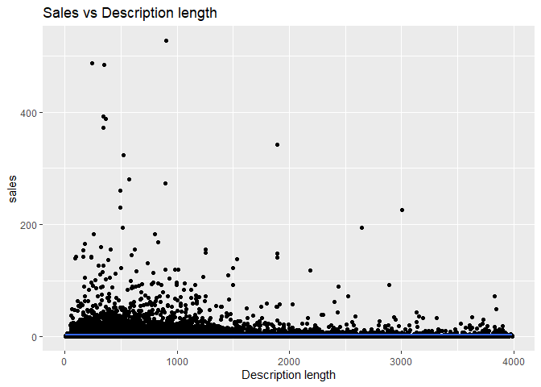
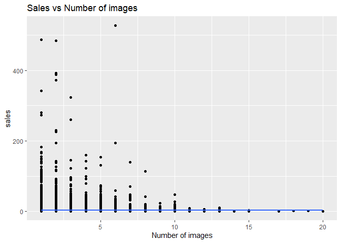
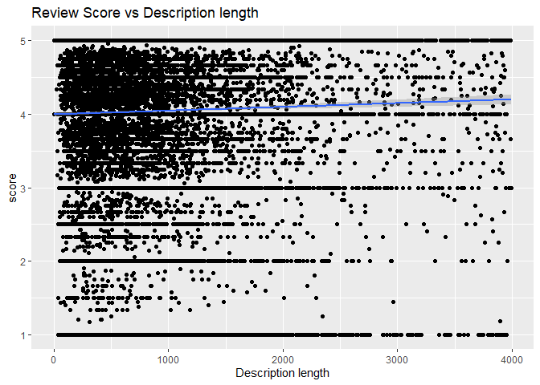
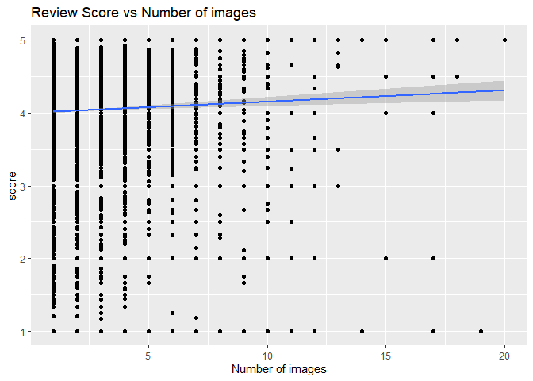

Introduction
============

In the era of e-commerce, every seller is trying to maximize their sales
on platforms like Olist. Their are many ways to achieve this through
optimizing different factors. Possibly two of them can be the **number
of images** a product listing has and the **length of its description**.

Intuitively we feel that maximizing both of them will result in more
sales, but even if that is true there are costs attached to it like
hiring a *content writer* and professional *product photographer*. Hence
in this analysis we want to figure out if there is any relation between
these two factors and KPIs of products and their magnitude.

#### Important:

*Since these are just two out of many factors, there are many
confounding variable which affects the KPIs of a product including many
intrinsic qualities which we cannot account for since we don’t have a
control group. Hence we can only comment on correlation and not
causation. Every result obtained in the analysis is just an interesting
possibility subject to further exploration by the business.*

Analysis on Sales KPI
=====================

Data Preparation
----------------

Setting the global options for the documentation.

    knitr::opts_chunk$set(warning = FALSE, message = FALSE)

Loading the required libraries.

    library(ggplot2)
    library(dplyr)

We will first load the individual datasets to calculate sales per
product, get description and number of images information for products
and translation for product category names respectively.

    orders <- read.csv("D:/Desktop/R/Projects/Olist-business-analysis/Original data/olist_order_items_dataset.csv")
    prods <- read.csv("D:/Desktop/R/Projects/Olist-business-analysis/Original data/olist_products_dataset.csv", stringsAsFactors=TRUE)
    translation <- read.csv("D:/Desktop/R/Projects/Olist-business-analysis/Original data/product_category_name_translation.txt")

Calculating the Sales per product and merging it with product
information.

    prod_sales <- orders %>% group_by(product_id) %>%
                summarise(sales=n())
    prod_sales <- merge(prod_sales,prods,"product_id")
    str(prod_sales)

    ## 'data.frame':    32951 obs. of  10 variables:
    ##  $ product_id                : chr  "00066f42aeeb9f3007548bb9d3f33c38" "00088930e925c41fd95ebfe695fd2655" "0009406fd7479715e4bef61dd91f2462" "000b8f95fcb9e0096488278317764d19" ...
    ##  $ sales                     : int  1 1 1 2 1 1 2 9 1 14 ...
    ##  $ product_category_name     : Factor w/ 74 levels "","agro_industria_e_comercio",..: 64 10 15 74 68 10 28 22 15 56 ...
    ##  $ product_name_lenght       : int  53 56 50 25 48 58 42 53 42 45 ...
    ##  $ product_description_lenght: int  596 752 266 364 613 177 2461 274 253 520 ...
    ##  $ product_photos_qty        : int  6 4 2 3 4 1 1 1 1 3 ...
    ##  $ product_weight_g          : int  300 1225 300 550 250 100 700 600 6000 600 ...
    ##  $ product_length_cm         : int  20 55 45 19 22 16 25 30 40 26 ...
    ##  $ product_height_cm         : int  16 10 15 24 11 15 5 20 4 8 ...
    ##  $ product_width_cm          : int  16 26 35 12 15 16 15 20 30 22 ...

Getting the final dataset to use for analysis. Also we will omit out any
observation with NAs in it.

    prod_sales <- prod_sales %>% group_by(product_id) %>% 
                summarise(sales= mean(sales),
                          cat=unique(product_category_name), 
                          desc_length= unique(product_description_lenght), 
                          no_img =unique(product_photos_qty))

    prod_sales <- prod_sales[complete.cases(prod_sales),]
    head(prod_sales)

    ## # A tibble: 6 x 5
    ##   product_id                       sales cat                  desc_length no_img
    ##   <chr>                            <dbl> <fct>                      <int>  <int>
    ## 1 00066f42aeeb9f3007548bb9d3f33c38     1 perfumaria                   596      6
    ## 2 00088930e925c41fd95ebfe695fd2655     1 automotivo                   752      4
    ## 3 0009406fd7479715e4bef61dd91f2462     1 cama_mesa_banho              266      2
    ## 4 000b8f95fcb9e0096488278317764d19     2 utilidades_domestic~         364      3
    ## 5 000d9be29b5207b54e86aa1b1ac54872     1 relogios_presentes           613      4
    ## 6 0011c512eb256aa0dbbb544d8dffcf6e     1 automotivo                   177      1

Now we will translate the category names from spanish to english.

    prod_sales$cat <- as.character(prod_sales$cat)
    for (i in 1:nrow(translation)) 
    {
        prod_sales$cat <- gsub(translation[i,1],translation[i,2],prod_sales$cat,
                               ignore.case = TRUE)
    }
    prod_sales$cat <- as.factor(prod_sales$cat)

Initial Results
---------------

Let us plot Sales vs Description length graph to understand the
relationship between them

    ggplot(data = prod_sales, aes(desc_length,sales)) + geom_point() + 
        geom_smooth(method = "lm") + labs(x="Description length",
                                        title = "Sales vs Description length")

From the general overview there seems to be no relationship present.
There are a few outlier products present which will be handles later on.

Let us plot Sales vs Number of images graph to understand the
relationship between them.

    ggplot(data = prod_sales, aes(no_img,sales)) + geom_point() + 
        geom_smooth(method = "lm") + labs(x="Number of images",
                                        title = "Sales vs Number of images")

From the general overview there seems to be no relationship present.
There are a few outlier products present which will be handles later on.

There is a possibility that the interaction between both the variables
is different withing separate categories. Hence if we can drill down to
that detail level we can obtain more insights.

Linear Regression
-----------------

We will now fit a linear model for all of 74 product categories but we
will only be considering those which have 10+ products sold since low
number of data points lead to significant increase in their individual
leveraging power.

An output data frame will be containing both coefficients and p values
obtained from the model for individual categories.

    cat_models <- data.frame()
    for (fact in unique(prod_sales$cat)) 
    {
        temp <- prod_sales %>% filter(cat==fact)
        if(nrow(temp) < 10)
        {
            next
        }
        fit <- lm(sales~no_img+desc_length,data = temp)
        img_co <- fit$coefficients[2]
        desc_co <- fit$coefficients[3]
        img_signif <- summary(fit)$coef[2,4]
        desc_signif <- summary(fit)$coef[3,4]
        cat_models <- rbind(cat_models,cbind(
                    img_co,desc_co,img_signif,desc_signif,fact))
    }
    head(cat_models)

    ##                      img_co               desc_co         img_signif
    ## no_img   0.0360148294846662  0.000290177795678378  0.903380188888789
    ## no_img1  -0.105709613430287   0.00043070812284716  0.100131197325144
    ## no_img2    0.59085654855422 -0.000785936155981669 0.0199964257390625
    ## no_img3   0.109729555539544  0.000182342675304631  0.155464698021598
    ## no_img4   0.544054975677367   0.00111706202359566 0.0649700799928616
    ## no_img5 -0.0221962185297981  9.35201695460547e-05  0.931594290309561
    ##               desc_signif           fact
    ## no_img   0.62663185549485      perfumery
    ## no_img1 0.021854046156556           auto
    ## no_img2 0.172935983363152 bed_bath_table
    ## no_img3 0.471452241147322     housewares
    ## no_img4 0.370121398000304  watches_gifts
    ## no_img5 0.888912165681325     cool_stuff

Final Results
-------------

Let us look at categories which have significant effect of number of
images.

    for (i in 1:4) 
    {
        cat_models[,i] <- as.numeric(cat_models[,i])
    }
    signi_img <- filter(cat_models,img_signif < 0.05)
    signi_img[,c(-2,-4)]

    ##              img_co   img_signif                                  fact
    ## no_img2   0.5908565 1.999643e-02                        bed_bath_table
    ## no_img8   0.5526964 1.306165e-02                         health_beauty
    ## no_img10 -0.7600605 7.994295e-03                 computers_accessories
    ## no_img11  0.3269382 4.139814e-04                                  toys
    ## no_img23  0.4181287 2.109303e-05              fashion_bags_accessories
    ## no_img38  1.0306009 2.089466e-02               costruction_tools_tools
    ## no_img44 -1.1486752 4.888118e-02                      office_furniture
    ## no_img48  1.1904395 2.261223e-04 small_appliances_home_oven_and_coffee
    ## no_img60  0.5178307 1.404820e-02                fashio_female_clothing

All of the categories have good correlation between number of images and
Sales while majority of them make intuitive sense. For categories like
beauty, accessories, appliances and fashion it is important for the
customers to look at the product well from different perspective to
decide whether they want to buy the particular product or not. Computer
accessories and office furniture have negative relationship probably due
to some other factors and while the result is interesting it need
further exploration.

Let us look at categories which have significant effect of Description
length.

    signi_desc <- filter(cat_models, desc_signif < 0.05)
    signi_desc[,c(-1,-3)]

    ##                desc_co  desc_signif                            fact
    ## no_img1   0.0004307081 2.185405e-02                            auto
    ## no_img13  0.0006962977 4.390901e-07                  sports_leisure
    ## no_img19  0.0006335283 7.264540e-03 construction_tools_construction
    ## no_img23 -0.0013088835 1.495295e-02        fashion_bags_accessories
    ## no_img26  0.0032552671 1.877255e-02              christmas_supplies
    ## no_img31  0.0007831922 3.726748e-02                            baby
    ## no_img32  0.0010134000 9.897725e-03                 home_appliances
    ## no_img40  0.0009373752 4.716104e-03                small_appliances
    ## no_img44 -0.0032578798 4.394182e-04                office_furniture
    ## no_img56  0.0007190012 3.631992e-07                           music
    ## no_img58  0.0016184883 4.671179e-02                  art_e_artanato

Even while these have statistical significance, its only because our two
variables could not explain a majority of variance in the data hence the
coefficient values are minuscule for the relationship between
description length and Sales. We can conclude with confidence that
description length has no significant effect on Sales of a product.

Analysis of Reviews KPI
=======================

We will first load the dataset to Obtain all the reviews posted on the
store. Since reviews dataset does not link directly to product id but to
order id, we will first merge it with orders dataset and have it act as
a link between reviews and product information

    reviews <- read.csv("D:/Desktop/R/Projects/Olist-business-analysis/Original data/olist_order_reviews_dataset.csv", stringsAsFactors=TRUE)

    prod_reviews <- merge(reviews,orders,"order_id")
    prod_reviews <- merge(prod_reviews,prods,"product_id")

Now we will compute the information we need for per product analysis, we
will be using arithmetic mean to find average review scores for a
product. Also we will omit out any observation with NAs in it.

    prod_reviews <- prod_reviews %>% group_by(product_id) %>% summarise(score= mean(review_score),cat=unique(product_category_name), desc_length= unique(product_description_lenght), no_img =unique(product_photos_qty))

    prod_reviews <- prod_reviews[complete.cases(prod_reviews),]

Now we will translate the category names from spanish to english.

    prod_reviews$cat <- as.character(prod_reviews$cat)
    for (i in 1:nrow(translation)) 
    {
        prod_reviews$cat <- gsub(translation[i,1],translation[i,2],
                                 prod_reviews$cat,ignore.case = TRUE)
    }
    prod_reviews$cat <- as.factor(prod_reviews$cat)

Initial Results
---------------

Let us plot Review Score vs Description length graph to understand the
relationship between them

    ggplot(data = prod_reviews, aes(desc_length,score)) + geom_point() + 
        geom_smooth(method = "lm") + labs(x="Description length",
                                        title ="Review Score vs Description length")

From the general overview there seems to be no or very weak positive
relationship present. There is a high concentration of values at low
description length, will be handle this later on.

Let us plot Review Score vs Number of images graph to understand the
relationship between them.

    ggplot(data = prod_reviews, aes(no_img,score)) + geom_point() + 
        geom_smooth(method = "lm") + labs(x="Number of images",
                                        title = "Review Score vs Number of images")

From the general overview there seems to be weak positive relationship
present. There is a high concentration of values at low number of
images, will be handle this later on.

There is a possibility that the interaction between both the variables
is different withing separate categories. Hence if we can drill down to
that detail level we can obtain more insights.

Linear Regression
-----------------

We will now fit a linear model for all of 74 product categories but we
will only be considering those which have 10+ products sold since low
number of data points lead to significant increase in their individual
leveraging power.

An output data frame will be containing both coefficients and p values
obtained from the model for individual categories.

    cat_models <- data.frame()
    for (fact in unique(prod_reviews$cat)) 
    {
        temp <- prod_reviews %>% filter(cat==fact)
        if(nrow(temp) < 10)
        {
            next
        }
        fit <- lm(score~no_img+desc_length,data = temp)
        img_co <- fit$coefficients[2]
        desc_co <- fit$coefficients[3]
        img_signif <- summary(fit)$coef[2,4]
        desc_signif <- summary(fit)$coef[3,4]
        cat_models <- rbind(cat_models,cbind(img_co,desc_co,img_signif,
                                             desc_signif,fact))
    }
    head(cat_models)

    ##                      img_co               desc_co          img_signif
    ## no_img  -0.0265435839093322 -6.96744526093364e-05   0.453262118884402
    ## no_img1  0.0145059266113819 -3.99332281599892e-05   0.379823273533603
    ## no_img2  0.0752899770466475  4.51449857264757e-06 0.00564643181157412
    ## no_img3  0.0101712673465913  1.83418818286072e-05   0.508356852715721
    ## no_img4 -0.0333212487782578  0.000311127003143707  0.0983098005412176
    ## no_img5 0.00061560188533133  7.84623132844645e-05   0.980152352024906
    ##                  desc_signif           fact
    ## no_img      0.32752678380169      perfumery
    ## no_img1    0.407810517529734           auto
    ## no_img2    0.941718417825624 bed_bath_table
    ## no_img3    0.715998517015921     housewares
    ## no_img4 0.000270641841889605  watches_gifts
    ## no_img5    0.220938017199424     cool_stuff

Final Results
-------------

Let us look at categories which have significant effect of number of
images.

    for (i in 1:4) 
    {
        cat_models[,i] <- as.numeric(cat_models[,i])
    }
    signi_img <- filter(cat_models,img_signif < 0.05)
    signi_img[,c(-2,-4)]

    ##               img_co  img_signif                              fact
    ## no_img2   0.07528998 0.005646432                    bed_bath_table
    ## no_img10  0.07100408 0.002496729             computers_accessories
    ## no_img13  0.02835756 0.028050785                    sports_leisure
    ## no_img64 -1.45517863 0.028828924 furniture_mattress_and_upholstery

Even while 3 these have statistical significance, its only because our
two variables could not explain a majority of variance in the data hence
the coefficient values are minuscule for the relationship between
description length and review score. Furniture have negative
relationship probably due to some other factors and while the result is
interesting since we obtained similar result while analyzing for sales,
it need further exploration.

Let us look at categories which have significant effect of Description
length.

    signi_desc <- filter(cat_models, desc_signif < 0.05)
    signi_desc[,c(-1,-3)]

    ##                desc_co  desc_signif                  fact
    ## no_img4   3.111270e-04 2.706418e-04         watches_gifts
    ## no_img7   9.931178e-05 1.330770e-02       furniture_decor
    ## no_img9   6.462375e-04 2.471620e-02         fashion_shoes
    ## no_img11  2.671318e-04 8.159442e-05                  toys
    ## no_img21 -9.361404e-04 3.767929e-02 fashion_male_clothing
    ## no_img27  2.276626e-04 3.193066e-02            stationery
    ## no_img31  1.866539e-04 1.642125e-02                  baby
    ## no_img44  4.290350e-04 3.305127e-04      office_furniture

As seen with images, inspite statistical significance they have
negligible effect on review scores. We can conclude with confidence that
both description length and number of images have no significant effect
on Review score of a product.

Conclusion
==========

The only Managerially Significant result that we could obtain was the
positive correlation between **Number of images in a product listing and
its sales for few select categories**. This is only true for few
categories for which customers explicitly look out for how the product
looks from different POVs. For rest of the categories number of images
do not have that high an effect due to either:

-   Few or singular images portraying all the required details
-   Customer researching products offsite and coming to buy with an
    existing decision.
-   Products for which looking at different POVs is not important.

Description length had absolutely no effect on anything, while Review
score is not effected by either of the two factors that we took into
considerations.

Hence a seller should research the category they are going to be selling
in and accordingly optimize their spending which can lower the initial
costs for putting a product up for sale on an e-commerce site.
