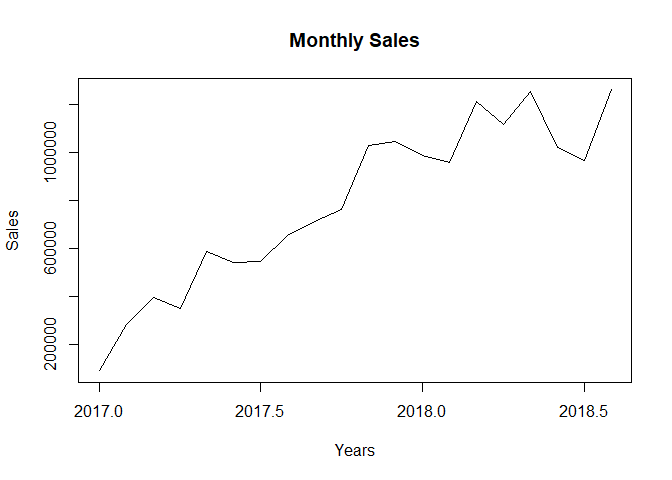
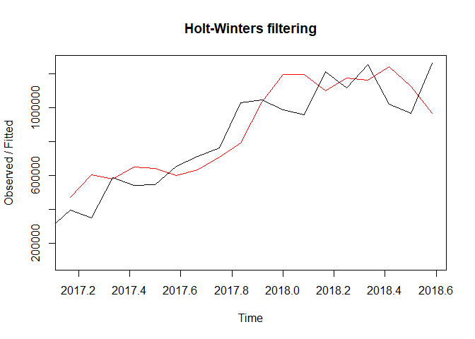
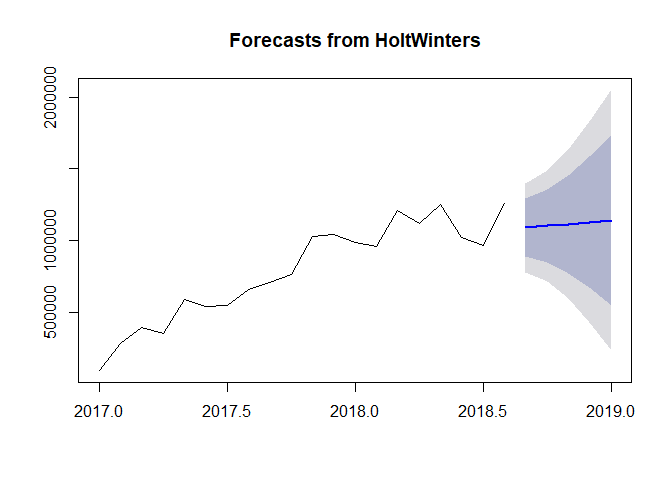

Being able to make accurate predictions of future revenue can be hugely
important for businesses. For example, if we can forecast the next
month’s revuenue, we can inform the decision-making process across all
areas of the business, from purchasing decisions,, marketing activity,
staffing levels or which invoices to pay and when.

In this notebook, we’ll use this monthly sales dataset to build a
forcast model to predict the next year’s sales revenue of the Company
Olist, which operates in Brazil.

Data Loading and Pre-Processing
-------------------------------

First we load all the necessary packages

    library(dplyr)
    library(forecast)
    library(tseries)
    library(trend)
    library(seastests)

Now we read and examine the data set for our sales.

    order <- read.csv("~/R Projects/Olist-business-analysis/Original data/olist_order_items_dataset.csv", stringsAsFactors=FALSE)
    str(order)

    ## 'data.frame':    112650 obs. of  7 variables:
    ##  $ order_id           : chr  "00010242fe8c5a6d1ba2dd792cb16214" "00018f77f2f0320c557190d7a144bdd3" "000229ec398224ef6ca0657da4fc703e" "00024acbcdf0a6daa1e931b038114c75" ...
    ##  $ order_item_id      : int  1 1 1 1 1 1 1 1 1 1 ...
    ##  $ product_id         : chr  "4244733e06e7ecb4970a6e2683c13e61" "e5f2d52b802189ee658865ca93d83a8f" "c777355d18b72b67abbeef9df44fd0fd" "7634da152a4610f1595efa32f14722fc" ...
    ##  $ seller_id          : chr  "48436dade18ac8b2bce089ec2a041202" "dd7ddc04e1b6c2c614352b383efe2d36" "5b51032eddd242adc84c38acab88f23d" "9d7a1d34a5052409006425275ba1c2b4" ...
    ##  $ shipping_limit_date: chr  "2017-09-19 09:45:35" "2017-05-03 11:05:13" "2018-01-18 14:48:30" "2018-08-15 10:10:18" ...
    ##  $ price              : num  58.9 239.9 199 13 199.9 ...
    ##  $ freight_value      : num  13.3 19.9 17.9 12.8 18.1 ...

    head(order)

    ##                           order_id order_item_id
    ## 1 00010242fe8c5a6d1ba2dd792cb16214             1
    ## 2 00018f77f2f0320c557190d7a144bdd3             1
    ## 3 000229ec398224ef6ca0657da4fc703e             1
    ## 4 00024acbcdf0a6daa1e931b038114c75             1
    ## 5 00042b26cf59d7ce69dfabb4e55b4fd9             1
    ## 6 00048cc3ae777c65dbb7d2a0634bc1ea             1
    ##                         product_id                        seller_id
    ## 1 4244733e06e7ecb4970a6e2683c13e61 48436dade18ac8b2bce089ec2a041202
    ## 2 e5f2d52b802189ee658865ca93d83a8f dd7ddc04e1b6c2c614352b383efe2d36
    ## 3 c777355d18b72b67abbeef9df44fd0fd 5b51032eddd242adc84c38acab88f23d
    ## 4 7634da152a4610f1595efa32f14722fc 9d7a1d34a5052409006425275ba1c2b4
    ## 5 ac6c3623068f30de03045865e4e10089 df560393f3a51e74553ab94004ba5c87
    ## 6 ef92defde845ab8450f9d70c526ef70f 6426d21aca402a131fc0a5d0960a3c90
    ##   shipping_limit_date  price freight_value
    ## 1 2017-09-19 09:45:35  58.90         13.29
    ## 2 2017-05-03 11:05:13 239.90         19.93
    ## 3 2018-01-18 14:48:30 199.00         17.87
    ## 4 2018-08-15 10:10:18  12.99         12.79
    ## 5 2017-02-13 13:57:51 199.90         18.14
    ## 6 2017-05-23 03:55:27  21.90         12.69

Since the Date field is still in the character format we change that
into Date type and also rename the variable (column) name.

    names(order)[5] <- "date"
    order$date <- as.POSIXct(order$date, format= "%Y-%m-%d %H:%M:%OS")

Now we have to first create columns denoting the Year and Month of the
respective order placed. This will help us later to compute monthly
sales by grouping the data.

    month <- as.numeric(format(order$date,'%m'))
    year <- as.numeric(format(order$date,'%Y'))
    head(month)

    ## [1] 9 5 1 8 2 5

    head(year)

    ## [1] 2017 2017 2018 2018 2017 2017

Using the dplyr package we will now compute the final column needed by
us, that is the Revenue generate by each order which will be the sum of
Item price and its Freight Value.

    order<- tbl_df(order)
    order <- order %>% mutate(year=year, month= month, total= price+freight_value)

Now we no longer have the need for the rest of the original columns of
the data set we will extract the three necessary columns only and order
them chronologically to look at them.

    order <- order[8:10]
    order <- order %>% arrange(year,month)
    head(order)

    ## # A tibble: 6 x 3
    ##    year month total
    ##   <dbl> <dbl> <dbl>
    ## 1  2016     9  47.8
    ## 2  2016     9  47.8
    ## 3  2016     9  47.8
    ## 4  2016     9  75.1
    ## 5  2016    10 261. 
    ## 6  2016    10 261.

Finally, like mentioned earlier we will group the data by year and month
and find sum of revenue for that time period resulting in us obtaining
the monthly Sales which we can use in Forecasting.

    order <- order %>% group_by(year,month)
    final <- order %>% summarise(sales= sum(total, na.rm=TRUE))
    final[c(1:3,24:26),]

    ## # A tibble: 6 x 3
    ## # Groups:   year [3]
    ##    year month   sales
    ##   <dbl> <dbl>   <dbl>
    ## 1  2016     9   219. 
    ## 2  2016    10 56945. 
    ## 3  2016    12    19.6
    ## 4  2018     9 16026. 
    ## 5  2020     2   175. 
    ## 6  2020     4   323.

When we look at the above shown data for the respective time periods, we
can clearly see that it is incompletely reported since they are nowhere
near the rest of the values. We will exclude them in our Analysis and
only use January 2017 through August 2018 Data.

    data <- final[4:23,3]

#### Final Time series form of Sales

We will convert our sales to a Time Series data type.

    TSD<-ts(data,start = c(2017,1),end=c(2018,8),frequency = 12)
    TSD

    ##             Jan        Feb        Mar        Apr        May        Jun
    ## 2017   92198.41  282731.52  396542.39  352845.76  586221.79  543623.12
    ## 2018  987044.01  958197.45 1209226.26 1116664.98 1252698.09 1021381.12
    ##             Jul        Aug        Sep        Oct        Nov        Dec
    ## 2017  544850.17  656244.33  711614.67  760543.96 1027375.70 1045817.04
    ## 2018  964848.75 1259175.95

Lets plot this data and try to visually analyse the Sales.

    plot(TSD,main="Monthly Sales",ylab="Sales", xlab="Years")

Looking at the Time Series plot we can definitely see a trend in the
data, but Seasonality is not clear. We will now dive into a number of
Statistical tests to confirm the nature of the data.

Statistical Testing
-------------------

First test for trend, Mann-Kendall Trend test (H0: There is no trend;
H1: There is trend. Thus, if p&lt;0.05, reject H0)

    mk.test(TSD)

    ## 
    ##  Mann-Kendall trend test
    ## 
    ## data:  TSD
    ## z = 4.7693, n = 20, p-value = 1.849e-06
    ## alternative hypothesis: true S is not equal to 0
    ## sample estimates:
    ##           S        varS         tau 
    ## 148.0000000 950.0000000   0.7789474

We will run another test, Cox-Stuart Trend Test (H0: There is no trend;
H1: There is monotonic trend. If p&lt;0.05, reject H0)

    cs.test(TSD)

    ## 
    ##  Cox and Stuart Trend test
    ## 
    ## data:  TSD
    ## z = 2.4529, n = 20, p-value = 0.01417
    ## alternative hypothesis: monotonic trend

Both the tests show that the Sales Time Series data does infact have a
trend. We will now test for seasonality. For this usually Webel and
Ollech test is used, but we do not have 2 complete periods of data which
is required for the test.

Hence we will use unconventional method for our seasonality detection,
Seasonalilty model detection. This is not a formal test of seasonality,
as the model selection is based on the AIC rather than any hypothesis
test.

    ets(TSD)

    ## ETS(A,Ad,N) 
    ## 
    ## Call:
    ##  ets(y = TSD) 
    ## 
    ##   Smoothing parameters:
    ##     alpha = 1e-04 
    ##     beta  = 1e-04 
    ##     phi   = 0.9723 
    ## 
    ##   Initial states:
    ##     l = 135337.4747 
    ##     b = 74626.0932 
    ## 
    ##   sigma:  125658.8
    ## 
    ##      AIC     AICc      BIC 
    ## 535.8140 542.2756 541.7884

Our main focus is ETS(A,Ad,N). Second value “Ad” denotes an addetive
trend and the third value “N” denotes No seasonality. So the Sales Time
series has NO seasonality.

We will Cross check our trend diagnosis with tests for Randomness. First
we have Wallis-Moore Phase Frequency (Randomness) Test (H0: The series
comprises random data; H1: The series is significantly different from
randomness. Thus, if p&lt;0.05, reject H0)

    wm.test(TSD)

    ## 
    ##  Wallis and Moore Phase-Frequency test
    ## 
    ## data:  TSD
    ## z = 0.83419, p-value = 0.4042
    ## alternative hypothesis: The series is significantly different from randomness

Second, Wald-Wolfowitz Test (H0: The series comprises random data; H1:
The series is significantly different from independence and
stationarity. If p&lt;0.05, reject H0)

    ww.test(TSD)

    ## 
    ##  Wald-Wolfowitz test for independence and stationarity
    ## 
    ## data:  TSD
    ## z = 3.0327, n = 20, p-value = 0.002423
    ## alternative hypothesis: The series is significantly different from 
    ##  independence and stationarity

Third, Bartels’s test for randomness (H0: The series comprises random
data; H1: The series is significantly different from independence and
stationarity. If p&lt;0.05, reject H0)

    bartels.test(TSD)

    ## 
    ##  Bartels's test for randomness
    ## 
    ## data:  TSD
    ## RVN = 0.32932, p-value = 4.565e-07
    ## alternative hypothesis: The series is significantly different from randomness

Now we have cross checked and are confident that The data has a specific
trent and is not a random data.

We will choose the Holt Winter’s algorithm for forecasting. The
Holt-Winters forecasting algorithm allows users to smooth a time series
and use that data to forecast areas of interest. Exponential smoothing
assigns exponentially decreasing weights and values against historical
data to decrease the value of the weight for the older data. In other
words, more recent historical data is assigned more weight in
forecasting than the older results.

Forecasting
-----------

Now we fit the model on our data.

    Train.model <- HoltWinters(TSD, beta = TRUE, gamma = FALSE)
    Train.model

    ## Holt-Winters exponential smoothing with trend and without seasonal component.
    ## 
    ## Call:
    ## HoltWinters(x = TSD, beta = TRUE, gamma = FALSE)
    ## 
    ## Smoothing parameters:
    ##  alpha: 0.373724
    ##  beta : TRUE
    ##  gamma: FALSE
    ## 
    ## Coefficients:
    ##         [,1]
    ## a 1076419.52
    ## b   13087.72

The alpha thus obtained is the smoothing constant, which is then used to
forecast values. Lets look at how the algorithm has been fitted over
historic values.

    Train.model$fitted

    ##               xhat     level      trend
    ## Mar 2017  473264.6  282731.5 190533.110
    ## Apr 2017  606451.9  444591.7 161860.168
    ## May 2017  578754.7  511673.2  67081.486
    ## Jun 2017  651417.4  581545.3  69872.131
    ## Jul 2017  640718.9  611132.1  29586.809
    ## Aug 2017  598648.8  604890.5  -6241.644
    ## Sep 2017  635456.8  620173.6  15283.178
    ## Oct 2017  707664.0  663918.8  43745.191
    ## Nov 2017  790934.2  727426.5  63507.690
    ## Dec 2017 1031169.6  879298.1 151871.544
    ## Jan 2018 1193989.3 1036643.7 157345.638
    ## Feb 2018 1196654.1 1116648.9  80005.200
    ## Mar 2018 1098425.4 1107537.1  -9111.775
    ## Apr 2018 1172131.5 1139834.3  32297.180
    ## May 2018 1162970.3 1151402.3  11568.012
    ## Jun 2018 1241605.2 1196503.8  45101.426
    ## Jul 2018 1122100.6 1159302.2 -37201.589
    ## Aug 2018  967361.4 1063331.8 -95970.369

    plot(Train.model)

As we can see, due to the lack of the historical data we had, it is not
a perfect fit but it is still good enough to draw rough projections. Let
us now finally Forecast sales for next 5 months, ie. Sept, Oct Nov, Dec
2018 and January 2019.

    Forecast <- forecast(Train.model,h=5)
    Forecast

    ##          Point Forecast    Lo 80   Hi 80    Lo 95   Hi 95
    ## Sep 2018        1089507 886149.9 1292865 778499.1 1400515
    ## Oct 2018        1102595 848709.4 1356481 714310.5 1490879
    ## Nov 2018        1115683 774447.9 1456917 593809.0 1637556
    ## Dec 2018        1128770 671762.7 1585778 429837.5 1827703
    ## Jan 2019        1141858 547506.3 1736210 232875.4 2050841

Lets also plot this data and take a look.

    plot(Forecast)

The blue line shows the Point estimates for the forecasts. The darker
zone is the 80% interval which means that future sales have 80% chance
of being in this interval. Similarly the Lighter zone is the 95%
interval.

With this we have completed our Forecasting of Sales.
