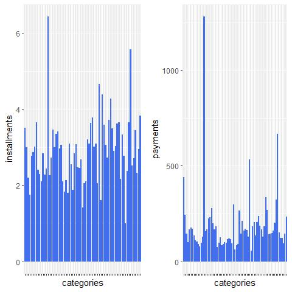
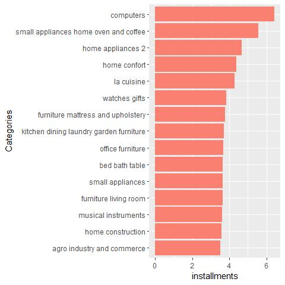
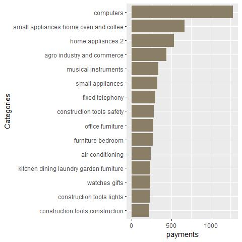
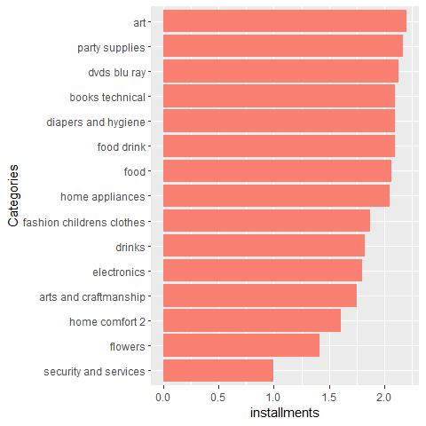
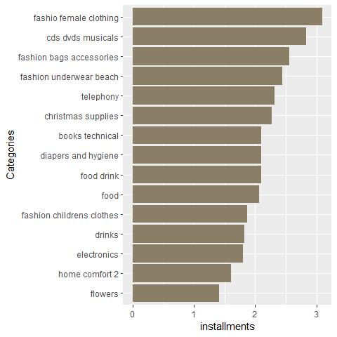

Intoduction
-----------

Understanding the spending behaviour and pattern of the customers is
very important for all the companies no matter what industry the operate
in. In this analysis we attempt to acheive the above said goal and
derive actionable insights from it.

We will be conductiong general analysis to look for patterns and
outliers of the payment behaviour in every individual product category.

Data Loading and Pre-Processing
-------------------------------

Setting the global options for documentation.

    knitr::opts_chunk$set(warning=FALSE, message = FALSE)

Loading all the required libraries.

    library(dplyr)
    library(stringr)
    library(gridExtra)
    library(forcats)
    library(ggplot2)

Loading the customer payment dataset that was created for the said
analysis and can be found in the joined datasets folder.

    customer_payment <- read.csv("~/R Projects/Olist-business-analysis/Joined data/customer_payment.csv", stringsAsFactors=FALSE)
    str(customer_payment)

    ## 'data.frame':    95420 obs. of  74 variables:
    ##  $ customer_unique_id                          : chr  "0000366f3b9a7992bf8c76cfdf3221e2" "0000b849f77a49e4a4ce2b2a4ca5be3f" "0000f46a3911fa3c0805444483337064" "0000f6ccb0745a6a4b88665a16c9f078" ...
    ##  $ catg_agro_industry_and_commerce             : int  0 0 0 0 0 0 0 0 0 0 ...
    ##  $ catg_air_conditioning                       : int  0 0 0 0 0 0 0 0 0 0 ...
    ##  $ catg_art                                    : int  0 0 0 0 0 0 0 0 0 0 ...
    ##  $ catg_arts_and_craftmanship                  : int  0 0 0 0 0 0 0 0 0 0 ...
    ##  $ catg_audio                                  : int  0 0 0 0 0 0 0 0 0 0 ...
    ##  $ catg_auto                                   : int  0 0 0 0 0 0 0 0 0 0 ...
    ##  $ catg_baby                                   : int  0 0 0 0 0 0 0 0 0 0 ...
    ##  $ catg_bed_bath_table                         : int  1 0 0 0 0 0 0 0 0 0 ...
    ##  $ catg_books_general_interest                 : int  0 0 0 0 0 0 0 0 0 0 ...
    ##  $ catg_books_imported                         : int  0 0 0 0 0 0 0 0 0 0 ...
    ##  $ catg_books_technical                        : int  0 0 0 0 0 0 0 0 0 0 ...
    ##  $ catg_cds_dvds_musicals                      : int  0 0 0 0 0 0 0 0 0 0 ...
    ##  $ catg_christmas_supplies                     : int  0 0 0 0 0 0 0 0 0 0 ...
    ##  $ catg_cine_photo                             : int  0 0 0 0 0 0 0 0 0 0 ...
    ##  $ catg_computers                              : int  0 0 0 0 0 0 0 0 0 0 ...
    ##  $ catg_computers_accessories                  : int  0 0 0 0 0 0 0 0 0 0 ...
    ##  $ catg_consoles_games                         : int  0 0 0 0 0 0 0 0 0 0 ...
    ##  $ catg_construction_tools_construction        : int  0 0 0 0 0 0 0 0 0 0 ...
    ##  $ catg_construction_tools_lights              : int  0 0 0 0 0 0 0 0 0 0 ...
    ##  $ catg_construction_tools_safety              : int  0 0 0 0 0 0 0 0 0 0 ...
    ##  $ catg_cool_stuff                             : int  0 0 0 0 0 0 0 0 0 0 ...
    ##  $ catg_costruction_tools_garden               : int  0 0 0 0 0 0 0 0 0 0 ...
    ##  $ catg_costruction_tools_tools                : int  0 0 0 0 0 0 0 0 0 0 ...
    ##  $ catg_diapers_and_hygiene                    : int  0 0 0 0 0 0 0 0 0 0 ...
    ##  $ catg_drinks                                 : int  0 0 0 0 0 0 0 0 0 0 ...
    ##  $ catg_dvds_blu_ray                           : int  0 0 0 0 0 0 0 0 0 0 ...
    ##  $ catg_electronics                            : int  0 0 0 0 0 0 0 0 0 0 ...
    ##  $ catg_fashio_female_clothing                 : int  0 0 0 0 0 0 0 0 0 0 ...
    ##  $ catg_fashion_bags_accessories               : int  0 0 0 0 0 0 0 0 1 0 ...
    ##  $ catg_fashion_childrens_clothes              : int  0 0 0 0 0 0 0 0 0 0 ...
    ##  $ catg_fashion_male_clothing                  : int  0 0 0 0 0 0 0 0 0 0 ...
    ##  $ catg_fashion_shoes                          : int  0 0 0 0 0 0 0 0 0 0 ...
    ##  $ catg_fashion_sport                          : int  0 0 0 0 0 0 0 0 0 0 ...
    ##  $ catg_fashion_underwear_beach                : int  0 0 0 0 0 0 0 0 0 0 ...
    ##  $ catg_fixed_telephony                        : int  0 0 0 0 0 0 0 0 0 0 ...
    ##  $ catg_flowers                                : int  0 0 0 0 0 0 0 0 0 0 ...
    ##  $ catg_food                                   : int  0 0 0 0 0 0 0 0 0 0 ...
    ##  $ catg_food_drink                             : int  0 0 0 0 0 0 0 0 0 0 ...
    ##  $ catg_furniture_bedroom                      : int  0 0 0 0 0 0 0 0 0 0 ...
    ##  $ catg_furniture_decor                        : int  0 0 0 0 0 0 0 0 0 0 ...
    ##  $ catg_furniture_living_room                  : int  0 0 0 0 0 0 0 0 0 0 ...
    ##  $ catg_furniture_mattress_and_upholstery      : int  0 0 0 0 0 0 0 0 0 0 ...
    ##  $ catg_garden_tools                           : int  0 0 0 0 0 1 0 0 0 0 ...
    ##  $ catg_health_beauty                          : int  0 1 0 0 0 0 0 0 0 0 ...
    ##  $ catg_home_appliances                        : int  0 0 0 0 0 0 0 0 0 0 ...
    ##  $ catg_home_appliances_2                      : int  0 0 0 0 0 0 0 0 0 0 ...
    ##  $ catg_home_comfort_2                         : int  0 0 0 0 0 0 0 0 0 0 ...
    ##  $ catg_home_confort                           : int  0 0 0 0 0 0 0 0 0 0 ...
    ##  $ catg_home_construction                      : int  0 0 0 0 0 0 0 0 0 0 ...
    ##  $ catg_housewares                             : int  0 0 0 0 0 0 0 0 0 0 ...
    ##  $ catg_industry_commerce_and_business         : int  0 0 0 0 0 0 0 0 0 0 ...
    ##  $ catg_kitchen_dining_laundry_garden_furniture: int  0 0 0 0 0 0 0 0 0 0 ...
    ##  $ catg_la_cuisine                             : int  0 0 0 0 0 0 0 0 0 0 ...
    ##  $ catg_luggage_accessories                    : int  0 0 0 0 0 0 0 0 0 0 ...
    ##  $ catg_market_place                           : int  0 0 0 0 0 0 0 0 0 0 ...
    ##  $ catg_music                                  : int  0 0 0 0 0 0 0 0 0 0 ...
    ##  $ catg_musical_instruments                    : int  0 0 0 0 0 0 0 0 0 0 ...
    ##  $ catg_office_furniture                       : int  0 0 0 0 0 0 0 0 0 0 ...
    ##  $ catg_party_supplies                         : int  0 0 0 0 0 0 0 0 0 0 ...
    ##  $ catg_perfumery                              : int  0 0 0 0 0 0 0 0 0 0 ...
    ##  $ catg_pet_shop                               : int  0 0 0 0 0 0 0 0 0 0 ...
    ##  $ catg_security_and_services                  : int  0 0 0 0 0 0 0 0 0 0 ...
    ##  $ catg_signaling_and_security                 : int  0 0 0 0 0 0 0 0 0 0 ...
    ##  $ catg_small_appliances                       : int  0 0 0 0 0 0 0 0 0 0 ...
    ##  $ catg_small_appliances_home_oven_and_coffee  : int  0 0 0 0 0 0 0 0 0 0 ...
    ##  $ catg_sports_leisure                         : int  0 0 0 0 0 0 0 2 0 1 ...
    ##  $ catg_stationery                             : int  0 0 1 0 0 0 0 0 0 0 ...
    ##  $ catg_tablets_printing_image                 : int  0 0 0 0 0 0 0 0 0 0 ...
    ##  $ catg_telephony                              : int  0 0 0 1 1 0 1 0 0 0 ...
    ##  $ catg_toys                                   : int  0 0 0 0 0 0 0 0 0 0 ...
    ##  $ catg_watches_gifts                          : int  0 0 0 0 0 0 0 0 0 0 ...
    ##  $ payment_installments                        : num  8 1 8 4 6 8 1 3 3 4 ...
    ##  $ payment_value                               : num  141.9 27.2 86.2 43.6 196.9 ...

First we will clean and collect all the category names.

    categories <- names(customer_payment)[c(-1,-73,-74)]
    categories <- str_remove_all(categories, "catg_")
    categories <- str_replace_all(categories, "_", " ")

Data Processing
---------------

Since our aim is to analyse paying behaviour, we will do this by
studying average number of installments and payments across different
categories.

For that, we will write two function which each can be used while
looping over categories to return us the mean installments and payments
for that category.

    funct_install <- function(x)
    {
        mean(customer_payment$payment_installments[x>=1], na.rm = TRUE)
    }
    funct_pay <- function(x)
    {
        mean(customer_payment$payment_value[x>=1], na.rm = TRUE)
    }

Now we will apply the functions over all the categories and store all
the means of installments as well as the payments.

    mean_installments <- sapply(customer_payment[,c(-1,-73,-74)], funct_install)
    mean_payments <- sapply(customer_payment[,c(-1,-73,-74)], funct_pay)

We will now clean and make a dataframe calle to\_plot to accumulate all
our previous computations conduct further analysis.

    mean_installments <- as.vector(mean_installments)
    mean_payments <- as.vector(mean_payments)
    to_plot <-cbind(categories,mean_installments,mean_payments)
    to_plot <- as.data.frame(to_plot)
    names(to_plot) <- c("categories","installments","payments")
    to_plot$installments <- as.numeric(as.character(to_plot$installments))
    to_plot$payments <- as.numeric(as.character(to_plot$payments))

Results
-------

Let us plot average number of installments as well as average payments
across all the categories that we have to get a good look on the general
trends.

    plot_install <- ggplot(data=to_plot, aes(x=categories, y= installments)) + 
        geom_bar(stat = "identity", fill="royalblue2") + 
        theme(axis.text.x = element_blank())

    plot_pay <- ggplot(data=to_plot, aes(x=categories, y= payments)) + 
        geom_bar(stat = "identity", fill="royalblue2") + 
        theme(axis.text.x = element_blank())

    grid.arrange(plot_install,plot_pay,ncol=2)

*Majority of the peaks of the graph so infact match*, but the same
cannot be definitively be said about rest of the data. Meaning costlier
the products of a category are, customers will take higher number of
installments to pay.

Let us now look at the 15 categories with the highest average of number
of installments.

    to_plot <- to_plot %>% arrange(desc(installments))
    top15_install <- to_plot[c(1:15),]
    bottom15_install <- to_plot[c(57:71),]
    plot1 <- ggplot(data=top15_install, aes(x=fct_reorder(categories,installments), 
    y= installments)) + geom_bar(stat = "identity", fill="salmon") +  coord_flip()+xlab("Categories")
    plot1

Just by browsing through these categories we can see majorly all of them
are big ticket purchases which requires few installments to completely
pay off. Highest being the category of **computers**.

We will now compare it to the 15 categories with highest average
payments so that we can comment on the relationship between them.

    to_plot <- to_plot %>% arrange(desc(payments))
    top15_pay <- to_plot[c(1:15),]
    bottom15_pay <- to_plot[c(57:71),]
    plot1 <- ggplot(data=top15_pay, aes(x=fct_reorder(categories,payments), 
    y= payments)) + geom_bar(stat = "identity", fill="wheat4") + 
        coord_flip() +xlab("Categories")
    plot1

We can clearly see categories like computers and small aplliances which
are at the top of average payments as well as average number of
installments.

Let us get a clear view of categories which are in highest payments but
not in highest installments.

    top15_pay[!(top15_pay$categories %in% top15_install$categories),]

    ##                         categories installments payments
    ## 7                  fixed telephony     2.680492 296.1230
    ## 8        construction tools safety     3.352410 278.4746
    ## 10               furniture bedroom     3.210623 266.3568
    ## 11                air conditioning     2.995352 242.1101
    ## 14       construction tools lights     3.000839 229.8486
    ## 15 construction tools construction     3.453120 223.9001

These categories are not bought in top 15 ranking number of
installments. - Construction related categories are still close to the
15th highers number of installments. - Fixed telephones and Air
conditioning are majorly bought on less installments.

***In general we can draw the conclusion that Categories that are more
expensive on average receive the payments for the orders in more number
of installments.***

Let us now look at the 15 categories with the Lowest average of number
of installments.

    plot2 <- ggplot(data=bottom15_install, aes(x=fct_reorder(categories,installments),
    y= installments)) + geom_bar(stat = "identity", fill="salmon") + 
        coord_flip() +xlab("Categories")
    plot2

Just by browsing through these categories we can see majorly all of them
are small ticket purchases which requires few installments to completely
pay off or are luxurious categories. Lowest being the category of
**Security and Services**.

We will now compare it to the 15 categories with Lowest average payments
so that we can comment on the relationship between them.

    plot2 <- ggplot(data=bottom15_pay, aes(x=fct_reorder(categories,installments), 
    y= installments)) + geom_bar(stat = "identity", fill="wheat4") + coord_flip()+xlab("Categories")
    plot2

We can see multiple categories like Flowers, home comfort2, electronics
etc which are at the bottom of average payments as well as the bottom of
average number of installments.

Let us get a clear view of categories which are in Lowest payments as
well as in lowest installments.

    bottom15_install[!(bottom15_install$categories %in% bottom15_pay$categories),]

    ##               categories installments payments
    ## 57                   art     2.205446 143.2666
    ## 58        party supplies     2.170940 140.6321
    ## 59          dvds blu ray     2.129310 124.4550
    ## 64       home appliances     2.048127 129.3493
    ## 68 arts and craftmanship     1.755102 101.6597
    ## 71 security and services     1.000000 162.2550

***We see categories which are still comparitively of lower cost on
average but are not in bottom 15, are still in botom 15 in number of
installments. This is clearly due to theem being luxury categories which
are not usually bought unless customer can financially afford to pay off
the cost in 1 or at most 2 installments.***

We conclude our analysis.
